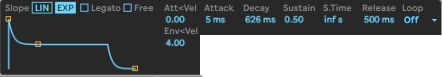
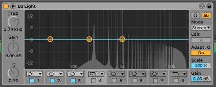
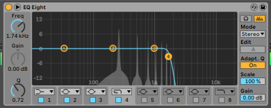
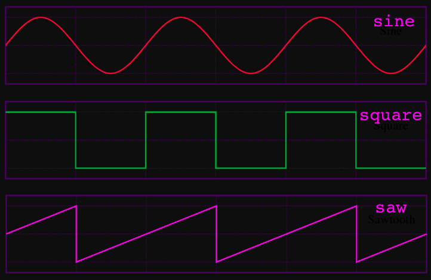

# Subtractive Synthesis with Analog
_Subtractive synthesis means using filters to remove certain frequences._

## Envelopes

- _Attack_ - the amount of time until the envelope reaches its max amount
- _Decay_ - amount of time from the max amount to the sustain amount
- _Sustain_ - amount when the envelope passes the attack and decay stage (when your finger is still holding down the note and hasn't let go yet)
- _Release_ - amount of time to get from the sustain amount to zero

Envelopes can control lots of different things, most synths will have an envelope for the amplitude, filter cut off, filter resonance and pitch - but sometimes envelopes can be attached to different parameters in different amounts.

### Try this!
> Play with the volume envelope first to get an idea of how envelopes work, it’s usually the easiest to hear what it’s doing. Write a little melody, loop it, and try turning the attack up and down slowly, then is back to 0, now try playing with the decay (slowly), make sure you try turning it all the way up and all the way down. Next, set the decay to 200ms and try playing with the sustain amount. Last of all try playing with the decay, slowly going from all the way up to all the way down. Now try changing the length of you midi notes in the midi clip and doing it again.

## Filtering
Removing certain frequencies from the frequency spectrum.

- _Low pass filter_ - removes high frequencies (only the low’s "pass" through) above the cut off
- _High pass filter_ - removes low frequencies (only the high’s "pass" through) below the cut off
- _Band pass filter_ - removes lows and highs and leaves only the frequencies at the filter cut off frequency
- _Notch filter_ - removes only the frequencies at the filter cut off frequency

- _Cut off frequency_ - the place in the frequency spectrum where the filter does it's magic
- _Resonance/Q_ - the curve of the filter (more resonance/q makes the filter "pointier")

### Try this!
> Grab a song that you know really well and drop it into Live, put auto filter on the same track, and try changing the cut off frequency. Now try a different filter shape and do the same thing. This will train your ear to hear the way the different filters sound and help you remember them.

## Wave Shapes

- _Sine wave_ - pure, simple, classic (ha). No overtones, just the fundamental (we will cover the meaning of those words later). Just remember it sounds clean and pure.
 - _Sawtooth wave_ - sharp, fuzzy, buzzy. All the partials (again don't worry about this word). This is what most synths use as their base sound because it is so full and has all the overtones.
- _Square wave_ - big and buzzy, hollow, "block"y, early computer game. Only even partials.
- _Noise_ - fuzzy, tv static. Just a buncha malarkey.

### Try this!
> Write a little melody in a midi clip and loop it. Turn off the second oscillator in Analog and try changing the wave shape of the first oscillator to hear the different sounds. Try changing your filter settings while it’s playing. Now turn on the second oscillator and try combining the different wave shapes, play with the filter again to see how it sounds. Training your ear to know how these shapes sound will be helpful later when you want to quickly make your synth sound the way you hear it in your head.

## Unison

- _Unison_ means the synth will play two or more "voices" out of tune with each other. The unison amount is how out of tune the two (or more) voices are. 
- _Voices_ - how many separate notes the synth can play at the same time. If it has only one voice, it is called "monophonic", if it has 2 or more it is called "polyphonic". Usually the amount of voices used in your unison setting, will not be affected, controlled or limited by the amount of voices set in the synth settings (for example analog can be monophonic, but with 4 voice unison, so only one separate note will play at the same time - so you can’t play C and F# at the same time - but each note will have 4 voices slightly out of tune with each other).

## Glide / Glissando / Gliss
These terms are usually used interchangeably.
- _Glide_ - The amount of time it takes for the synth to glide its pitch from one note to the next, this can either be a curve, or a straight path (subtle difference, but sometimes you can control which one you want).
- _Legato_ - if you play another note while one is already playing, the second note will not be retriggered, it will be the continuation of the previous note. (Honestly this doesn't always work the same way, different synths will mean different things, it’s best to just try it out and see what it sounds like - sometimes it means that it will only glide if two notes are played at the same time, sometimes it’s it controls retriggering on certain envelopes but not others, don’t worry about it too much, use your ears!)

### Try this!
> Write a little melody in a midi clip and loop it. Turn on unison and turn it up and down, turn on gliss/glide and turn it up and down (slowly). These two together can make even a happy melody sound creepy.
